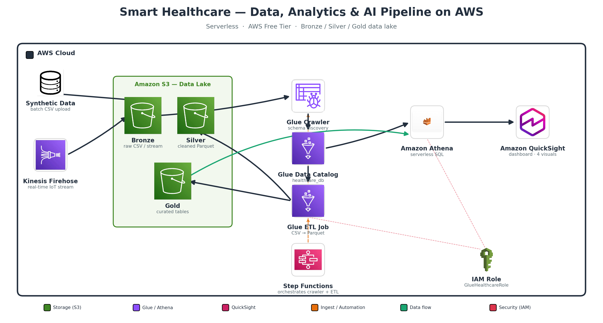

# Cloud-Based Data Analytics & AI Pipeline for Smart Healthcare

An end-to-end, **serverless data and AI pipeline** built on **AWS Free Tier** that turns raw hospital data into actionable insights — for a hospital consortium use case ("Smart Hospital Operations Dashboard").

> **Course:** Cloud Computing & Big Data — S3 Final Project
> **Type:** Proof of Concept (POC), AWS Free Tier only, synthetic data only

---

## Team

- Prince Sharma
- Bhanu Prakash Kuncham
- Syed Amaan
- Sarvan Chattu
- Venkatesh Lankalapalli

---

## Architecture



Data flows left to right through a fully serverless pipeline:

**Ingestion** (batch CSV + Kinesis Firehose real-time) → **Amazon S3 data lake** (Bronze / Silver / Gold) → **AWS Glue** (Crawler + Data Catalog + ETL to Parquet) → **Amazon Athena** (serverless SQL) → **Amazon QuickSight** (dashboard). **Step Functions** orchestrates the pipeline and **IAM** secures it. An optional **AI model** predicts patient readmission.

---

## AWS Services Used

| Layer | Service | Purpose |
|-------|---------|---------|
| Ingestion | Amazon Kinesis Data Firehose + batch upload | Real-time IoT stream + batch files into S3 |
| Storage | Amazon S3 | Data lake with Bronze / Silver / Gold zones |
| ETL | AWS Glue (Crawler + Spark ETL Job) | Schema discovery + CSV → Parquet transform |
| Catalog | AWS Glue Data Catalog (`healthcare_db`) | Central table/schema registry |
| Query | Amazon Athena | Serverless SQL analytics |
| Visualization | Amazon QuickSight | Interactive dashboard (4 visuals) |
| Automation | AWS Step Functions | Orchestrates crawler → ETL job |
| Security | AWS IAM (`GlueHealthcareRole`) | Least-privilege access control |
| AI (bonus) | scikit-learn (Random Forest) | 30-day readmission prediction |

---

## Repository Structure

```
.
├── README.md
├── diagrams/            Architecture diagram
├── docs/                Technical report, implementation guide, speaking script
├── src/                 Data generator, Glue ETL job, Step Functions definition
├── sql/                 Athena analytics queries
├── notebooks/           Demo notebook + AI model notebook
├── ml/                  Model training script and result plots
├── presentation/        Slide deck
└── data/sample/         Small sample of the synthetic datasets (100 rows each)
```

---

## How to Reproduce

1. **Generate data** — run `src/generate_data.py` to create the three synthetic datasets (patients, vitals, operations).
2. **Create an S3 bucket** with `bronze/`, `silver/`, `gold/`, `athena-results/` folders; upload the CSVs into `bronze/`.
3. **Run the Glue Crawler** over `bronze/` to build the `healthcare_db` catalog tables.
4. **Run the Glue ETL job** (`src/glue_etl_job.py`) to clean data and write Parquet to Silver/Gold.
5. **Run the Athena queries** in `sql/athena_queries.sql`.
6. **Build the QuickSight dashboard** from the Athena tables.
7. **(Optional) Automate** with the Step Functions workflow (`src/step_functions_definition.json`).
8. **(Optional) Train the AI model** with `ml/train_model.py` or the notebook in `notebooks/`.

Full step-by-step instructions with screenshots are in `docs/Implementation_Guide.docx`.

---

## Key Findings

- **Emergency** is the busiest department (~78.5% occupancy) and has the longest waits — the operational bottleneck.
- **Readmission risk rises with age**: patients aged 65+ have the highest 30-day readmission rate (~32%).
- **IoT vitals reflect severity**: emergency admissions show a much higher average heart rate (~105) than planned admissions (~78).
- **AI model**: Random Forest predicts 30-day readmission with ~68% accuracy; **age** and **length of stay** are the strongest predictors.

---

## Constraints Honored

- AWS Free Tier only
- Single S3 bucket, ≤ 2 Glue jobs, single Athena database
- Synthetic data only (no real patient data)
- Serverless automation (no virtual machines)

---

## Notes

The datasets in `data/sample/` are **synthetic** and intentionally small samples (100 rows) for reference. Full datasets are generated by `src/generate_data.py`. No real or personal health data is used anywhere in this project.
